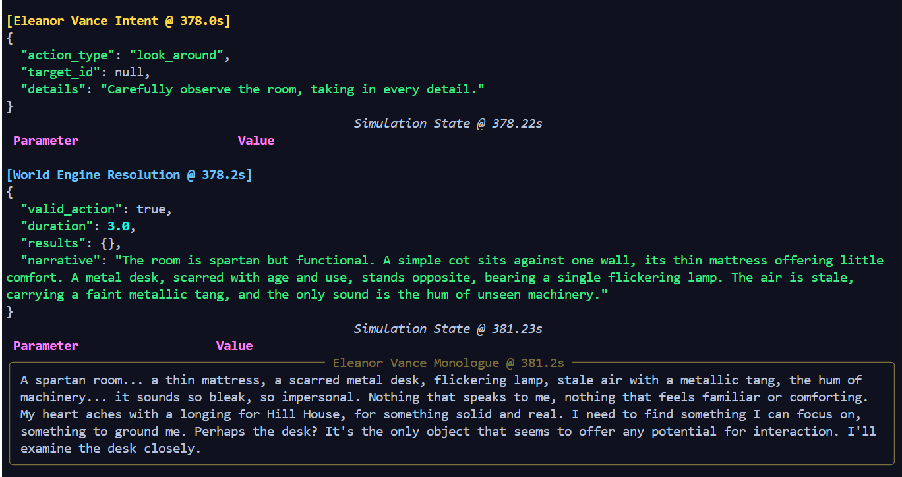

# TheSimulation

Exploring Simulation Theory through Large Language Models

Latest Update as of 5/19/2025
* Current state - Fully functional - Needs enhancements and contributions welcomed.
* World Generation Fixed - missing models.py - temporary, full world creation will be migrated to ADK.
* Image generation moved to Imagen 3 - Bluesky integration live
* To DO:
* Rework of life_generation.py using ADK - migrataion in progress and option to post entire life generation sequence to Bluesky
* Posting of interactions to Bluesky - possibly to keep up with realtime updates.  Exploring feasibility or practicality
* Life graph - all interactions mapping for Data Analysis in graph format.  TBD
* Further tools use by simulacra ie. Email access / X(Twitter) / Blueksy etc... web browsing.

## Table of Contents

- [Project Overview](#project-overview)
- [Practical Applications](#practical-applications)
- [Conceptual Framework](#conceptual-framework)
- [Core Architecture: A Glimpse Under the Hood](#core-architecture-a-glimpse-under-the-hood)
- [Getting Started](#getting-started)
- [Running the Simulation](#running-the-simulation)
- [Configuration (`config.py` and `.env`)](#configuration-configpy-and-env)
- Logs and Data Structure
- Observing the Simulation
- Future Directions

## Project Overview

TheSimulation is an experiment exploring simulation theory utilizing Large Language Models (LLMs). This project investigates how LLMs, specifically through frameworks like the Google AI Developer Kit (ADK), can be used to create autonomous agents ("Simulacra") that perceive, reflect, and act within a simulated environment.

The project aims to use LLMs to generate and analyze diverse simulated scenarios by giving agents with personas, goals, and a structured thinking process.

## Practical Applications

This research has potential practical applications across various fields:

1.  **Consumer Research and Product Development:** Simulating consumer behavior, testing product concepts.
2.  **Political Science:** Modeling political systems, simulating policy impacts.
3.  **Environmental Studies:** Projecting climate scenarios, modeling ecosystem responses.
4.  **Urban Planning:** Simulating city development, modeling traffic patterns.
5.  **Educational Tools:** Developing immersive historical simulations, creating interactive learning environments.
6.  **Psychological Research:** Simulating social interactions, exploring cognitive processes.
7.  **Crisis Management:** Simulating disaster scenarios, modeling response strategies.
8.  **Entertainment Industry:** Developing rich fictional worlds, simulating audience reactions.
9.  **Ethical Decision Making:** Creating complex moral dilemmas for analysis.

## Framework

### Language as Compressed Reality

This project explores the potential of Large Language Models (LLMs) in the context of the simulation theory. The premise is that language itself operates as a compressed, consensus-based representation of reality. This characteristic of language may enable LLMs to serve as a basis for simulating complex systems, including aspects of human experience and interaction, potentially extending to ancestral simulations.

Language is an efficient system for encoding and transmitting information about the world. It functions as a form of compression where complex phenomena, entities, and experiences are distilled into symbolic units—words and concepts. This system is built upon consensus: we, as users of a language, collectively agree on the general meaning and attributes associated with these symbols.

For instance, when we use the words "dog" or "cat," we convey an "invariant representation"—a shared understanding of these animals—despite the vast individual differences in specific dogs or cats we might have encountered. This shared experience, encoded in language, allows for effective communication of complex ideas through relatively simple linguistic tokens. Language, therefore, can be seen as a collectively constructed and continuously refined model of reality.

Because language is this compressed representation of reality, an LLM in theory learns our reality. It doesn't just learn vocabulary and grammar; it learns how concepts interrelate, how events typically unfold, and the underlying logic of the systems described in the text.

If LLMs learns this model, then LLMs could potentially be used to simulate aspects of that reality with some degree of fidelity. This project is to investigate the creation of a "digital twin" of the world and an individual to see what happens.

Currently it gives interesting results with all the mundane activities we conduct in life, will be running the system 24/7 with integration to X and Bluesky for realtime live updates of the simulation.

### Design

The simulation entities ("Simulacra") are designed as autonomous agents. While the current implementation uses a specific task-based asynchronous architecture (detailed in "Core Architecture"), the underlying agent behavior involves a perception-reflection-action cycle, primarily driven by LLMs interpreting their persona and the environment.

## Architecture

TheSimulation operates through a series of asynchronous components, orchestrated using Python's `asyncio` and leveraging the Google ADK for LLM interactions.

1.  **Central State (`state` dictionary):**

    - A Python dictionary holds the entire simulation's current reality: world details (time, mood, global events), object states, location descriptions, and the profiles and runtime status of all active Simulacra.
    - This state is loaded from and saved to JSON files (`data/states/`), enabling persistence and resumption of simulations.

2.  **Time Manager (`time_manager_task`):**

    - An asynchronous task responsible for advancing the simulation clock based on `SIMULATION_SPEED_FACTOR`.
    - It processes events scheduled for completion (e.g., when an agent's action finishes) from the `pending_results_queue` and applies their effects to the central `state`.

3.  **Event Bus System (Asynchronous Queues):**

    - The simulation employs several `asyncio.Queue` instances as event buses. These facilitate decoupled, asynchronous communication between the various system components and agents.
    - Key queues include:
      - `intent_queue`: Simulacra agents place their chosen actions (intents) here.
      - `world_engine_output_queue`: The World Engine places its action resolutions here.
      - `narration_queue`: Resolved actions are sent here for the Narrator to process.
      - `pending_results_queue`: Completed action effects are queued here before being applied by the Time Manager.
    - _Technical Note on Event Handling:_ While the Google ADK offers Agent-to-Agent (A2A) communication, this project currently uses a custom system of `asyncio.Queue`s for broader asynchronous interaction. This was chosen for its simplicity and flexibility during initial development.

4.  **Simulacra Agents (`simulacra_agent_task_llm`):**

    - Each active Simulacrum is an independent asynchronous task driven by an LLM.
    - **Persona & Goals:** Operates based on its unique "life summary" (defining its personality, background, and initial goals) loaded from `data/life_summaries/`.
    - **Perception-Reflection-Action Cycle:**
      1.  **Observe:** Gathers comprehensive context from the simulation `state`: its current location, nearby objects and NPCs, recent narrative events, its own status (mood, needs), the global `world_mood`, and its core persona.
      2.  **Reflect & Decide (LLM Call):** This rich context is fed to its primary LLM (e.g., Gemini). Guided by a detailed prompt, the LLM generates an internal monologue (simulating a structured thinking process: Recall/React -> Analyze Goal -> Identify Options -> Prioritize/Choose) and decides on its next action.
      3.  **Output Intent:** The chosen action is formatted as a structured JSON "intent" (e.g., `{"action_type": "move", "target_id": "door_main", "details": "try the handle"}`).
      4.  **Declare Intent:** The intent is placed onto the `intent_queue` for processing.
    - **Self-Reflection & Interruptions:** Simulacra can be interrupted during long actions for self-reflection (re-evaluating their goals or situation) or by minor dynamic events generated by the simulation, adding a layer of unpredictability.

5.  **World Engine (`world_engine_task_llm`):**

    - An asynchronous task that consumes intents from the `intent_queue`.
    - **LLM-Powered Resolution:** It utilizes an LLM (the "World Engine Agent") to interpret the agent's intended action. This interpretation considers the current world `state`, including object properties, location rules, and the acting agent's capabilities.
    - **Determines Outcomes:** The World Engine LLM decides if the action is valid, calculates its duration in simulation time, determines the direct consequences (e.g., changes to object states, agent location), and generates a factual, objective description of the outcome.
    - The World Engine's structured output is then passed to the `narration_queue`.

6.  **Narrator (`narration_task`):**

    - An asynchronous task that processes the resolved action outcomes from the `narration_queue`.
    - **LLM-Powered Storytelling:** It employs an LLM (the "Narrator Agent") to transform the factual outcome from the World Engine into a stylized narrative paragraph. This narration aims to adhere to the current `world_mood_global`, adding flavor and context.
    - **Discovery Mechanism:** Following "look_around" actions, the Narrator also processes the World Engine's findings to identify and log new ephemeral objects, NPCs, and environmental connections, enriching the perceived world.
    - The final narrative is appended to the simulation's main `narrative_log` (visible in the console and logs) and is also used to update the "last observation" for relevant agents.

7.  **Supporting System Tasks:**

    - `interaction_dispatcher_task`: A pre-processing step that classifies agent intents before they reach the World Engine.
    - `dynamic_interruption_task`: Periodically checks for agents engaged in long actions and probabilistically introduces minor, unexpected events to interrupt them, adding dynamism.
    - `world_info_gatherer_task`: Periodically updates global world feeds (e.g., simulated weather, news headlines) using LLMs. For "realtime" simulations, it can use a dedicated "Search Agent" (also LLM-powered) to fetch and summarize real-world information.
    - `narrative_image_generation_task`: If enabled, this task periodically selects recent narrative segments and uses an image generation model to create visual representations, saving them to `data/images/` (or `data/narrative_images/`).

8.  **Google ADK Integration:**
    - The project primarily uses the Google Agent Development Kit (ADK) for its `LlmAgent` class, which provides a convenient abstraction for interacting with LLMs (like Gemini models).
    - ADK's `SessionService` is used for managing the lifecycle of these LLM agent interactions.
    - The `InMemoryMemoryService` from ADK is used for basic memory functions, such as storing the initial persona details for agents.
    - ADK's tool-calling capabilities are leveraged, for example, by the Search Agent to use a `google_search` tool.

## Getting Started

### Prerequisites

- Python 3.11+
- Git

### Setup

1.  **Clone the repository:**
    ```bash
    git clone https://github.com/dsshean/TheSimulation.git
    cd TheSimulation
    ```
2.  **Set up a virtual environment (recommended):**
    ```bash
    python -m venv venv
    source venv/bin/activate  # On Windows use `venv\Scripts\activate`
    ```
3.  **Install dependencies:**
    ```bash
    pip install -r requirements.txt
    # Dependencies include: google-adk, google-generativeai, python-dotenv, rich, etc.
    ```
4.  **Set up Configuration (API Key & Settings):**

    - Create a `.env` file in the project root directory (you can copy `.env.sample` if it exists and rename it to `.env`).
    - Add your Google API Key to this `.env` file. This is essential for the LLMs to function.
      ```dotenv
      GOOGLE_API_KEY="YOUR_ACTUAL_GOOGLE_API_KEY"
      ```
    - You can also override other default settings from `src/config.py` in this `.env` file. See the Configuration (`config.py` and `.env`) section for more details.

5.  **World Setup (`setup_simulation.py`)**
    - Run the `setup_simulation.py` script. This interactive script will guide you through:
      - Defining the basic parameters of your simulation world (e.g., genre, location).
      - Generating initial "life summaries" (personas, goals, backstories) for your Simulacra agents using an LLM.
    ```bash
    python setup_simulation.py
    ```
    - This script will create two crucial types of files in the `data/` directory:
      - `data/states/world_config_[uuid].json`: Contains the initial configuration and static details of your simulation world. (This file might initially be created in `data/` and then used to form part of the full simulation state).
      - `data/life_summaries/life_summary_[AgentName]_[uuid].json`: Contains the detailed persona for each Simulacrum. These are essential for agents to operate.

## Running the Simulation

Once the setup is complete and your `.env` file is configured, you can start the simulation using the `main_async.py` script:

```bash
python main_async.py
```

## Important Notes for Running:

    - Agent Count: While the architecture is designed for multiple agents, multi-agent interactions are still under active development and refinement. For initial runs and stability, it's recommended to start with a single Simulacrum.
    - Resuming/Resetting:
        - The simulation saves its full state periodically to a simulation_state_[uuid].json file in data/states/. If this file exists for a given world UUID, the simulation will attempt to resume from it.
        - To reset a world to its initial conditions (as defined by world_config_[uuid].json and the life summaries), delete the corresponding simulation_state_[uuid].json file from data/states/. The world_config_[uuid].json itself contains the initial setup and is not the running state.

### Configuration (`config.py` and `.env`)

The simulation's behavior is controlled by a set of parameters defined in `src/config.py`. This file serves as the central hub for default settings. For local development and customization, many of these settings can be conveniently overridden by creating a `.env` file in the project's root directory. This is the recommended way to manage sensitive information like API keys and to tweak simulation parameters without modifying the core codebase.

To use environment-based configuration, create a `.env` file in the root of your project. Here's an example based on common settings:

```dotenv
# --- Essential ---
GOOGLE_API_KEY="YOUR_ACTUAL_GOOGLE_API_KEY"

# --- Model Selection (Optional - Defaults are in config.py) ---
# Primary LLM for agent reasoning, world engine, etc.
# MODEL_GEMINI_PRO="gemini-2.0-flash"
# LLM for search agent and potentially other lighter tasks
# SEARCH_AGENT_MODEL_NAME="gemini-2.0-flash"
# LLM for image generation
# IMAGE_GENERATION_MODEL_NAME="gemini-2.0-flash" # Or your preferred image model

# --- Simulation Speed & Duration (Optional) ---
# SIMULATION_SPEED_FACTOR=1.0 # Multiplier for simulation time progression (e.g., 2.0 is twice as fast)
# UPDATE_INTERVAL=0.1         # Real-time seconds between simulation state updates and display refresh
# MAX_SIMULATION_TIME=7200.0  # Maximum simulation time in seconds (e.g., 7200s = 2 sim hours)

# --- Agent Behavior (Optional) ---
# AGENT_INTERJECTION_CHECK_INTERVAL_SIM_SECONDS=120.0 # How often (sim seconds) agents consider self-reflection
# LONG_ACTION_INTERJECTION_THRESHOLD_SECONDS=300.0  # Min sim-duration of an action for self-reflection to be considered
# INTERJECTION_COOLDOWN_SIM_SECONDS=450.0           # Cooldown (sim seconds) before an agent can be interjected again (self-reflection or dynamic)
# PROB_INTERJECT_AS_SELF_REFLECTION=0.60            # Probability an agent will self-reflect if conditions are met

# --- Dynamic Interruptions (Optional) ---
# DYNAMIC_INTERRUPTION_CHECK_REAL_SECONDS=5.0       # How often (real seconds) the system checks to dynamically interrupt busy agents
# DYNAMIC_INTERRUPTION_TARGET_DURATION_SECONDS=600.0 # Sim-duration of an action at which the target interruption probability is met
# DYNAMIC_INTERRUPTION_PROB_AT_TARGET_DURATION=0.05 # Target probability (e.g., 0.05 = 5%) for interruption at the target duration
# DYNAMIC_INTERRUPTION_MIN_PROB=0.005               # Minimum probability for any eligible action to be interrupted
# DYNAMIC_INTERRUPTION_MAX_PROB_CAP=0.15            # Absolute maximum probability cap for an interruption check
# MIN_DURATION_FOR_DYNAMIC_INTERRUPTION_CHECK=60.0  # Actions shorter than this (sim seconds) won't be dynamically interrupted

# --- World Information (Optional) ---
# WORLD_INFO_GATHERER_INTERVAL_SIM_SECONDS=3600.0 # How often (sim seconds) world feeds (weather, news) are updated
# MAX_WORLD_FEED_ITEMS=5                          # Max number of items to keep for each feed category

# --- Narrative Image Generation (Optional) ---
# ENABLE_NARRATIVE_IMAGE_GENERATION=true            # Set to "true" to enable, "false" to disable
# IMAGE_GENERATION_INTERVAL_REAL_SECONDS=1800.0     # How often (real seconds) to generate an image from the narrative

# --- Miscellaneous (Optional) ---
# RANDOM_SEED_VALUE=42 # Integer value for reproducible randomness, or leave unset for random behavior
```

### Key Configuration Parameters in `src/config.py`:

Below is a description of the main parameters defined in src/config.py. Many can be overridden using the `.env` file as shown above.

### Core API and Model Configuration:

- API_KEY (Env: GOOGLE_API_KEY): Essential. Your Google API key for accessing Gemini models.
- MODEL_NAME (Env: MODEL_GEMINI_PRO, Default: gemini-1.5-flash-latest or similar): The primary Gemini model used for complex reasoning tasks by Simulacra agents, the World Engine, and other core LLM interactions.
- SEARCH_AGENT_MODEL_NAME (Env: SEARCH_AGENT_MODEL_NAME, Default: gemini-1.5-flash-latest or similar): The Gemini model used by the dedicated search agent.
- IMAGE_GENERATION_MODEL_NAME (Env, Default: gemini-1.0-pro-vision-001 or similar): The model for narrative image generation. Ensure you use a model capable of image generation.

### Simulation Parameters:

- SIMULATION_SPEED_FACTOR (Env, Default: 1.0): Multiplier for simulation time progression relative to real time.
- UPDATE_INTERVAL (Env, Default: 0.1): Real-world seconds between main simulation loop updates and display refreshes.
- MAX_SIMULATION_TIME (Env, Default: 96000.0): Maximum simulation time in simulation seconds before the simulation automatically stops.
- MEMORY_LOG_CONTEXT_LENGTH (Default: 10): Number of recent narrative entries provided to Simulacra agents as part of their immediate context.
  Agent Self-Reflection & Dynamic Interruption Parameters: These control how agents might pause long tasks for self-reflection or be interrupted by minor dynamic events.

- AGENT_INTERJECTION_CHECK_INTERVAL_SIM_SECONDS (Env, Default: 120.0)
- LONG_ACTION_INTERJECTION_THRESHOLD_SECONDS (Env, Default: 300.0)
- INTERJECTION_COOLDOWN_SIM_SECONDS (Env, Default: 450.0)
- PROB_INTERJECT_AS_SELF_REFLECTION (Env, Default: 0.60)
- DYNAMIC_INTERRUPTION_CHECK_REAL_SECONDS (Env, Default: 5.0)
- DYNAMIC_INTERRUPTION_TARGET_DURATION_SECONDS (Env, Default: 600.0)
- DYNAMIC_INTERRUPTION_PROB_AT_TARGET_DURATION (Env, Default: 0.35)
- MIN_DURATION_FOR_DYNAMIC_INTERRUPTION_CHECK (Env, Default: 60.0)

### World Information Gatherer:

- WORLD_INFO_GATHERER_INTERVAL_SIM_SECONDS (Env, Default: 3600.0): How often (in simulation seconds) world feeds (e.g., weather, news) are updated.
- MAX_WORLD_FEED_ITEMS (Env, Default: 5): Maximum number of items to retain for each feed category.

### Narrative Image Generation:

- ENABLE_NARRATIVE_IMAGE_GENERATION (Env, Default: False): Set to "true" to enable image generation.
- IMAGE_GENERATION_INTERVAL_REAL_SECONDS (Env, Default: 1800.0): Frequency (in real-world seconds) of image generation attempts.

### Random Seed:

- RANDOM_SEED (Env: RANDOM_SEED_VALUE, Default: None): If set to an integer, this seed is used for random number generation, allowing for reproducible runs (for aspects dependent on random). If None, randomness will vary.

### Paths & Keys:

- BASE_DIR, STATE_DIR, LIFE_SUMMARY_DIR, IMAGE_GENERATION_OUTPUT_DIR (or NARRATIVE_IMAGE_OUTPUT_DIR): These define the directory structure for storing data, state files, agent profiles, and generated images. They are typically derived from the project's root.
- Various \_KEY constants (e.g., SIMULACRA_KEY, WORLD_STATE_KEY): Internal string constants used to consistently access parts of the main simulation state dictionary. They are generally not meant for direct user configuration via .env but are central to the codebase's state management.

Refer to src/config.py for the full list of parameters, their default values, and more specific comments.

### Logs and Data

The `data/` directory is the primary location for all persistent files related to your simulations. It typically contains the following subdirectories:

- **`data/life_summaries/`**:
  - Stores the initial persona and background information for each Simulacrum agent.
  - These are typically JSON files (e.g., `life_summary_AgentName_uuid.json`) generated by `setup_simulation.py`.
- **`data/states/`**:
  - Contains saved simulation states.
  - Each state file (e.g., `world_config_uuid.json` or `simulation_state_uuid.json`) is a JSON representation of the entire world at a specific point, allowing simulations to be paused and resumed.
- **`data/logs/`**:
  - Holds various log files generated during simulation runs.
  - This includes the main application log (e.g., `simulation_run_YYYY-MM-DD_HH-MM-SS.log`) and the structured event log (e.g., `simulation_events_YYYY-MM-DD_HH-MM-SS.jsonl`).
- **`data/narrative_images/`**:
  - Stores any images generated by the narrative image generation task, if enabled.
  - These images visually represent scenes or moments from the simulation's narrative.

**Important**
Ugly hack for now - might be limitations for Google ADK, but there seems to be issues with context passing. Out of the box ADK does not supposed async bus implementation unless you use A2A. To keep things simple a simple hack was created for various event buses so all the agents can interact asynchronusly.

The setup_simulation.py will create the initial world state and simulacras located in data\life_summaries. Two files are needed for the simulation to run:
world_config_uuid.json
life_summary_name_uuid.json

to reset the world to starting conditions, remove the world_config_uuid.json from data\states\ directory

### Observing the Simulation

Examine the output both from console and the log file, which you will find some interesting and weird interactions which points to the need for further refinement. For whatever reason the world_engine seems to always narrate extremely horror movie esque settings if no initial conditions are given...

Narration agent: "The room is bleak without any features, there are no doors or windows..." or other strange and at times humours outputs.



The simulation provides rich output to the console (using the rich library for a live, updating table display) and detailed logs in data/logs/. Here’s what you can typically observe:

- Simulacra Monologues: Rich text showing the agent's internal reasoning – reacting to observations ("The door is locked, drat!"), considering its persona ("As Eleanor Vance, a brewery guide, maybe I should look for local history books?"), weighing options, and finally stating its chosen action.
- Simulacra Intents: Clean JSON objects like {"action_type": "use", "target_id": "door_main", "details": "try the handle"} or {"action_type": "look_around", "target_id": null, "details": ""}.
- World Engine Resolutions: JSON outputs from the World Engine detailing the action's validity, duration, any state changes (results), and the crucial factual outcome description.
- Narrative Log: A growing list showing the chronological story unfolding, crafted by the Narrator based on the World Engine's outcomes: [T10.5] Eleanor Vance looks around., [T13.5] The room is dusty, containing only a table and a locked chest., [T15.0] Eleanor Vance tries the handle of the chest, but it's firmly locked.
- Narrative Tone & LLM Quirks: Pay attention to the Narrator agent's tone. While guided by world_mood, LLMs can sometimes produce unexpected stylistic interpretations (e.g., describing a "cozy home" with surprisingly bleak or dramatic flair). This is an inherent aspect of working with creative LLMs and an ongoing area for prompt refinement and experimentation.

### Future Directions

While the core loop is functional, several areas need development:

- Longer-Term Memory:

  - Current State: The project uses ADK's InMemoryMemoryService to store the initial persona, accessible via a load_memory tool. The main narrative_log serves as a short-term contextual memory but can grow large and lacks efficient semantic search.
  - Next Steps: Implementing persistent, searchable long-term memory. This could involve replacing or augmenting InMemoryMemoryService with VertexAiRagMemoryService (leveraging Vertex AI Vector Search). This would allow agents to semantically search their entire history of observations, actions, and reflections (e.g., "What did I learn about locked doors yesterday?", "Who did I talk to in the library?").

- Multi-Agent Interaction:

  - Current State: All interactions with NPCS exists and works - NPCs are defined as non world objects, it can be people or say a computer. A mountain wouldnt be considered an NPC.
  - Next Steps: Test multi-agent communication and collaboration/conflict. This includes refining how agents perceive and react to each other's actions, manage shared resources, and form social relationships.

- Real-World Sync & Dynamic Environments:

  - Current State: The simulation runs on its own accelerated or decelerated clock (SIMULATION_SPEED_FACTOR), also supports real world time sync so the world run in parallel to ours. The world_info_gatherer_task provides periodic updates for simulated news/weather, with an option for real-time search.
  - Next Steps & Considerations:
    - Enhanced Real-time Data Feeds: For contemporary simulations, deepening the integration of real-world data (weather, news, social trends) via APIs to dynamically influence the world_mood, available information, and potential events.
    - Fictional World History & Lore Evolution: For non-contemporary settings, developing mechanisms for generating and evolving rich world history and lore. This could involve on-demand LLM generation or structured knowledge bases that agents can query and contribute to.
    - Direct User Interaction / "Game Master" Mode: Improving mechanisms for an observer or "Game Master" to interact directly with Simulacra (e.g., ask questions, give commands) or inject specific events and narrative elements into the simulation.
    - Enhanced Spatial Reasoning & Detailed Locality: Integrating more detailed environmental information, potentially using map services for real-world locations or procedurally generated layouts for fictional ones, to allow for more complex spatial behaviors and exploration.

- External Tool Integration & Agent Capabilities:

  - Current State: Agents can use tools for web search (google_search) and image generation.
  - Next Steps:
    - Interact with Social Media (Simulated/Real): Develop tools for agents to post updates or read feeds on simulated social media platforms within the simulation, or potentially interact with real platforms like Bluesky via its API. (To Be Determined)
    - Simulated Communication Systems: Implement tools for agents to send/receive emails or messages, enabling more complex inter-agent or agent-to-outside-world communication. (To Be Determined)
    - Broader API Access: Connect to a wider range of external APIs (e.g., more detailed weather services, stock market data, translation tools, scientific knowledge bases) to enrich the simulation's data sources and agent capabilities. (To Be Determined)
    - These integrations will likely leverage robust communication patterns (A2A and MCP).
